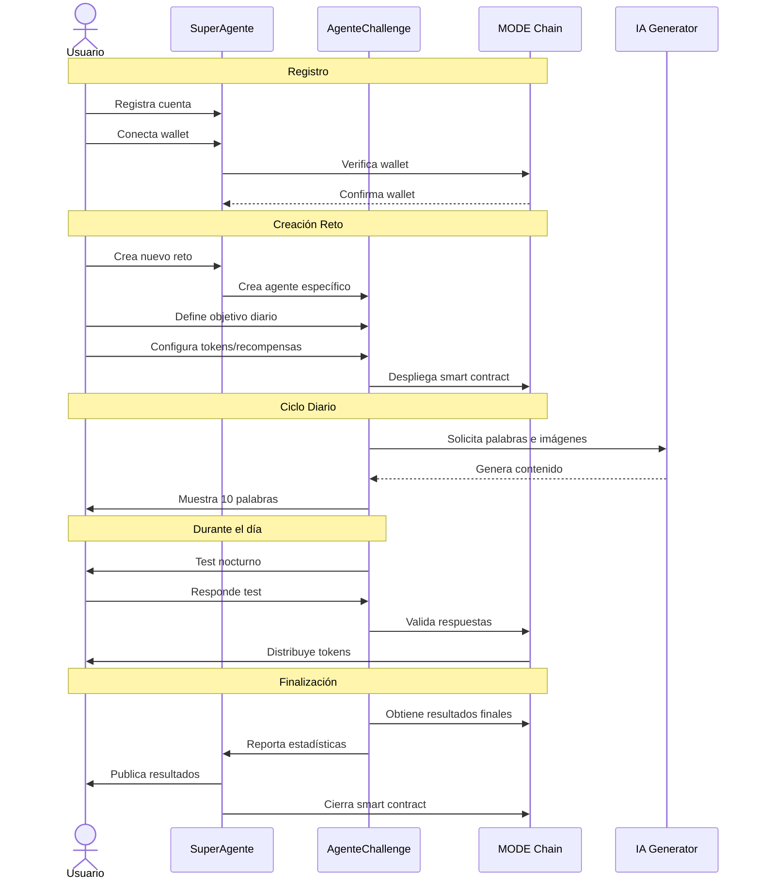

# Agente para aprendizaje de palabras

**Flujo de un Reto (Ejemplo: Aprendizaje de Inglés):**

1. **Registro y Configuración:** El usuario se registra a través de Clark y conecta su wallet. Crea un nuevo reto en Next.js, especificando las reglas (10 palabras/día), la duración, y la cantidad de tokens a repartir.
2. **Participación:** Otros usuarios con wallets conectadas se unen al reto.
3. **Tareas Diarias:** Dify presenta las 10 palabras diarias a cada participante a través de Next.js, utilizando imágenes generadas por IA.
4. **Evaluación:** Dify evalúa las respuestas del usuario y registra el progreso.
5. **Recompensa (On-Chain):** Dify interactúa con el contrato inteligente en MODE para distribuir las recompensas en proporción a los aciertos.
6. **Validación:** Los usuarios pueden validar los resultados en la blockchain.
7. **Comunicación:** Dify comunica los resultados diarios a los participantes a través de Next.js.
8. **Resultados Finales:** Al finalizar el reto, Dify genera un resumen del rendimiento de cada participante, visualizado con Mermaid en Next.js. Los resultados también se publican en canales públicos (ej. redes sociales, Discord).

**Consideraciones Técnicas:**

* **Contrato Inteligente (Solidity):** Necesario para gestionar las recompensas en MODE. Debe incluir funciones para depositar tokens, distribuir recompensas, y registrar el progreso del reto.
* **Integración Dify-Blockchain:** Dify debe poder interactuar con el contrato inteligente para enviar transacciones. Se pueden usar librerías como web3.js o ethers.js.
* **API REST:** Next.js se comunicará con Dify a través de una API REST.
* **Almacenamiento de Datos:** Además de la blockchain, se puede usar una base de datos para almacenar información adicional del reto (ej. configuración, imágenes generadas por IA).
